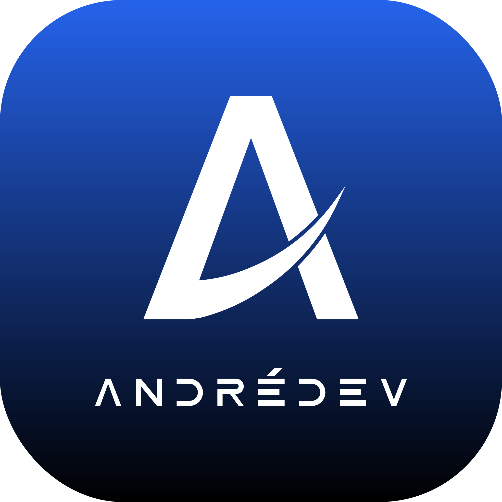

  

 

  

  

## 🚀 About me

I'm a **Systems Analysis and Development** student at **Senac University Center**, always looking to apply and expand my skills in technology.

My journey started with a **game development workshop** — building a small platformer opened my eyes to the endless possibilities of software development. Today I work across three creative fields:

- 🌐 **Web Development** — fullstack applications with Angular, Node.js/Express, SpringBoot and MySQL
- 🎮 **Game Development** — Unity Engine projects with multiplayer and cross-platform support
- 🎨 **3D Art & Animation** —
  modeling, texturing, rigging and animation in Blender

 

## 📫 Let's connect!  

  
  

 

## 🛠️ Tech Stack

  <h4>Languages</h4>
  

  <h4>Frameworks / Libraries</h4>
  

  <h4>Games / 3D</h4>
  
  

  <h4>Databases</h4>
  

  <h4>Tools / Platforms</h4>
  

  <h4>IDEs</h4>
  

 

## 👾 Contribution Graph

 <picture data-importer="pacman">
  
</picture>

 

## ⏱️ Coding Activity

  <a href="https://wakatime.com/@4e368b22-0f58-4fbb-bb3e-cea062362d21">
    
      
    
  </a>

  

